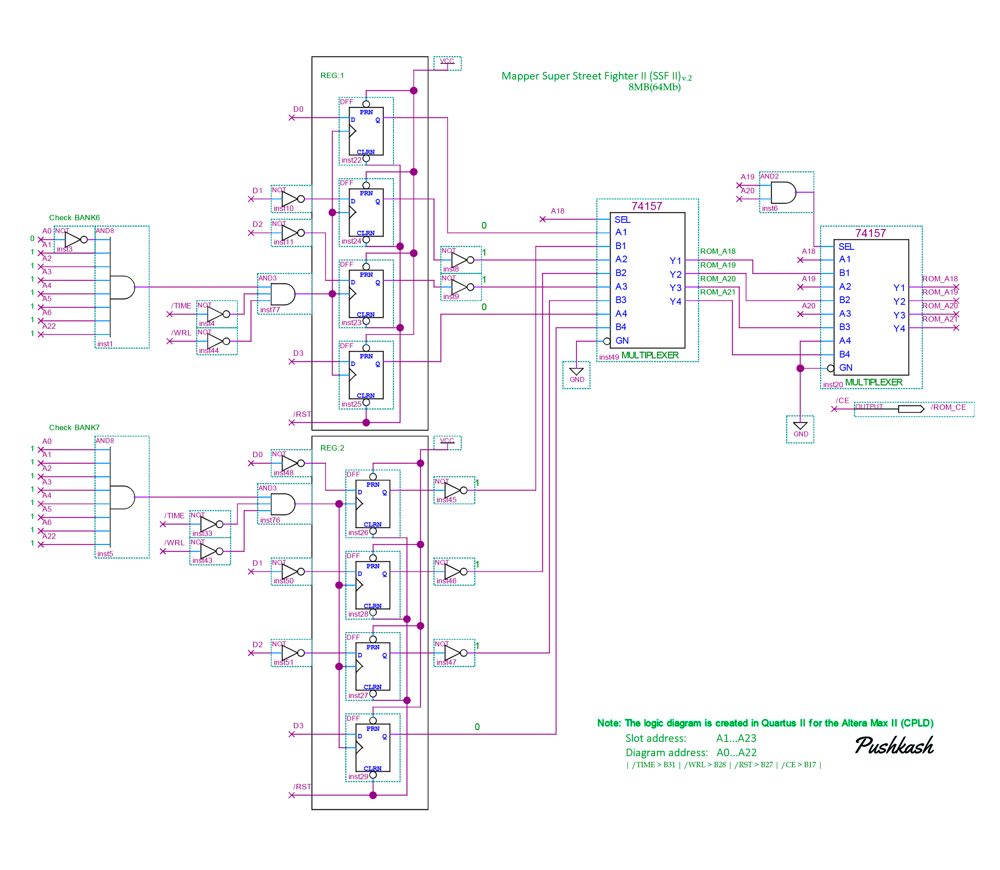
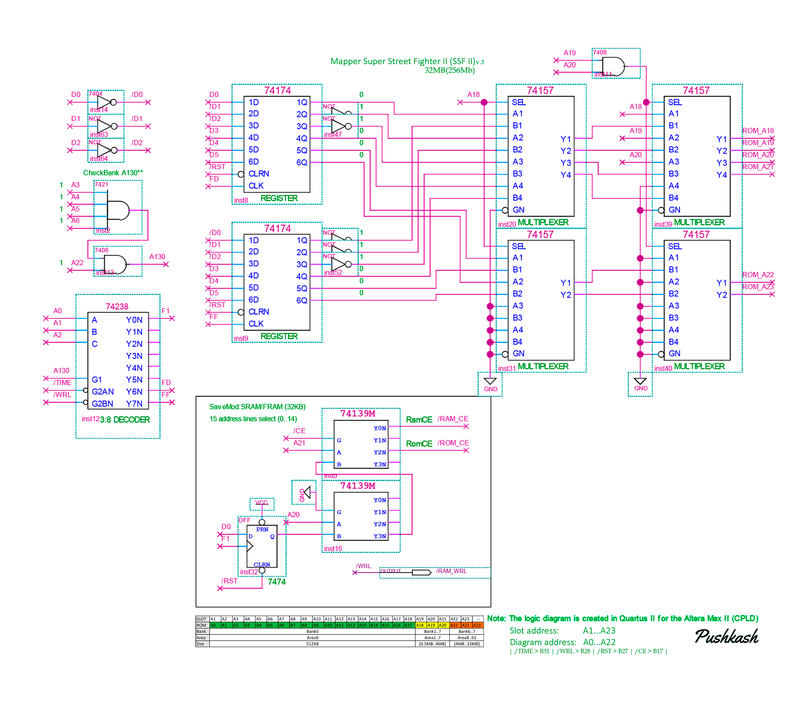
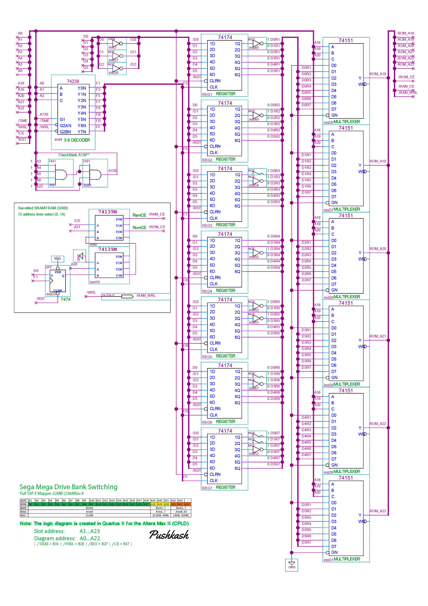

# 🕹️ Sega Mega Drive / Genesis Custom Mappers & Bank Switching

Коллекция принципиальных схем кастомных мапперов и систем переключения банков (Bank Switching) для картриджей Sega Mega Drive / Genesis. 

> **Автор:** Pushkash  
> Все схемы и архитектурные решения разработаны лично автором проекта.

---

## 🔍 Особенности адресации и работы с памятью

* **Прямая адресация $A0 \to A1$:** На схемах линия $A0$ микросхемы памяти подключается к линии $A1$ слота консоли. Так как шина данных Sega 16-битная и линия $A0$ на разъёме отсутствует, это упрощает разводку платы.
* **Энергонезависимое сохранение (32 KB):** В схемах v.3 и v.4 реализована полноценная поддержка энергонезависимой памяти **FRAM / SRAM объёмом 32 КБ** ($256 \text{ Кбит}$). Использование FRAM избавляет от необходимости ставить батарейку, диодные развязки и супервизоры питания.

---

## 🛠 Анализ схем и архитектуры

### 📌 v.2 — Маппер до 8 МБ (64 Мбит) на D-триггерах

* **Элементная база:** Построена на D-триггерах без блока сохранений.
* **Логика работы:**
  * **Банки 0–5:** Управляются напрямую процессором Motorola 68000.
  * **Стартовый пресет (Банки 6 и 7):** По умолчанию зафиксированы значения `Банк 6 = 6` и `Банк 7 = 7`, что позволяет считывать первые 4 МБ ROM сразу при включении.
  * **Переключение адресов:** Через триггеры задаются старшие биты адреса для обращения к памяти свыше 4 МБ.

---

### 📌 v.3 — Маппер до 32 МБ (256 Мбит) на 74HC174/74HC157 с FRAM/SRAM (32 KB)

* **Элементная база:** Регистры **74HC174**, мультиплексоры **74HC157** и поддержка памяти **FRAM / SRAM (32 КБ)**.
* **Логика переключения банков:**
  * **Банки 0–5:** Зафиксированы на процессоре Motorola 68000.
  * **Стартовый пресет (Банки 6 и 7):** По умолчанию `Банк 6 = 6` и `Банк 7 = 7` (доступ к первым 4 МБ).
  * **Адресация свыше 4 МБ ($A_{18}\dots A_{20}$):** 
    * **Банк 6** напрямую формирует бит адреса **$A_{18}$** Flash-памяти.
    * **Банк 7** формирует старшие биты адреса **$A_{19}$** и **$A_{20}$**.
    * Комбинация записи в Банк 6 и Банк 7 (например, `Банк 6 = 8`, `Банк 7 = 9`) выставляет нужные уровни на $A_{18}\dots A_{20}$, мгновенно переключая адресацию на нужный блок Flash-памяти объёмом до 32 МБ.

---

### 📌 v.4 — Полноценный маппер SSF2 до 32 МБ (256 Мбит) с FRAM/SRAM (32 KB)

* **Элементная база:** **7 регистров**, **6 мультиплексоров** и поддержка памяти **FRAM / SRAM (32 КБ)**.
* **Логика работы:**
  * **Банк 0:** Жестко зафиксирован (векторы прерываний и заголовок программы).
  * **Аппаратные пресеты при старте:** Выполнены через инверсию отдельных линий данных на регистрах, что аппаратно задаёт начальные состояния: `Регистр 1 = 1`, `Регистр 2 = 2` ... `Регистр 7 = 7`.

---

## 🖼 Файлы схем
* `SSF2_CARD_MAPP_v2.png` — Схема маппера v.2 до 8 МБ на D-триггерах.
* `SSF2_CARD_MAPP_v3_2.png` — Схема маппера v.3 до 32 МБ на 74HC174 / 74HC157 с FRAM/SRAM 32KB.
* `SegaMegaDriveBankSwitching2.png` — Схема маппера v.4 SSF2 (7 регистров / 6 мультиплексоров) с FRAM/SRAM 32KB.